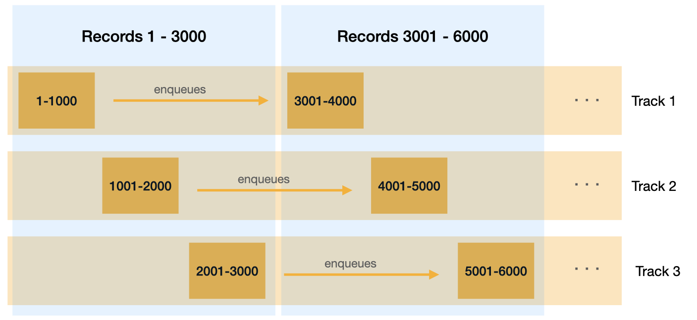

# MassEncryption

MassEncryption lets you encrypt large sets of data using [Active Record encryption](https://edgeguides.rubyonrails.org/active_record_encryption.html). 

Its main use case is adding encryption to existing applications where you have a large amount of existing data to encrypt.

It relies on [Active Job](https://guides.rubyonrails.org/active_job_basics.html) to create encryption jobs that take care of encrypting data in batches.

## Installation

Add this line to your application's Gemfile:

```ruby
gem 'mass_encryption'
```

## Usage

MassEncryption offers two modes of operation:

- Encrypt data in tracks (recommended)
- Encrypt data in parallel jobs

### Encrypt data in tracks (recommended)

When encrypting in tracks, you create a limited number of jobs that will encrypt a batch of records. Each job represents a track. When the job encrypts its batch, it enqueues the next batch in the track. 



This mode of encryption lets you keep the number of jobs you enqueue under control. This has two advantages:

- It avoids having to enqueue all the jobs ahead of time. For example, you don't normally want to enqueue millions of jobs up front to encrypt billions of rows.
- It lets you limit concurrency to avoid capacity issues.

You can launch the encryption in this mode with:

```shell
rake mass_encryption:encrypt_all_in_tracks
```

By default it will encrypt all the models with encrypted attributes using a batch size of 1000 records per job and one track, so only one job will encrypt data at any given moment.

For example:

```shell
# Encrypt all the posts starting with id 10 using 6 encryption jobs
rake mass_encryption:encrypt_all_in_tracks EXCEPT="Post" FROM_ID=10 TRACKS=6
```

### Encrypt data in parallel jobs

In this mode, it will simply loop through all the batches of records and enqueue a job for each.

By default it will encrypt all the models with encrypted attributes using a batch size of 1000 records per job.

```shell
# Encrypt all the posts starting with id 10 using as many jobs as needed to encrypt them in batches of 500 records 
rake mass_encryption:encrypt_all_in_parallel_jobs EXCEPT="Post" FROM_ID=10 BATCH_SIZE=500
```

### Options

You can customize it by passing the following environment variables when invoking the rake task:

* `ONLY`. Comma-separated list of class names to encrypt.
* `EXCLUDE`. Comma-separated list of class name to exclude.
* `FROM_ID`. Id to use as an anchor to start encryption. This is handy to resume encryption operations that got interrupted. Ids lower than it won't be encrypted. By default it will be the id of the first model record.
* `BATCH_SIZE`. The amount of records each job will encrypt. By default it's 1000.
* `TRACKS`: The number of tracks to use (only available when encrypting in tracks). By default it's 1.

## How it works

* MassEncryption internally uses [`upsert_all`](https://edgeapi.rubyonrails.org/classes/ActiveRecord/Persistence/ClassMethods.html#method-i-upsert_all) to perform fast updates in bulk.

* If there was some error when trying to update the records, MassEncryption jobs will try to encrypt the records in the batch one by one. They will collect all the individual errors and raise a single `MassEncryption::MassEncryption::BatchEncryptionError` error aggregating them all. This way, one record failing to encrypt won't prevent other records in the batch from being encrypted. 

## License

The gem is available as open source under the terms of the [MIT License](https://opensource.org/licenses/MIT).
